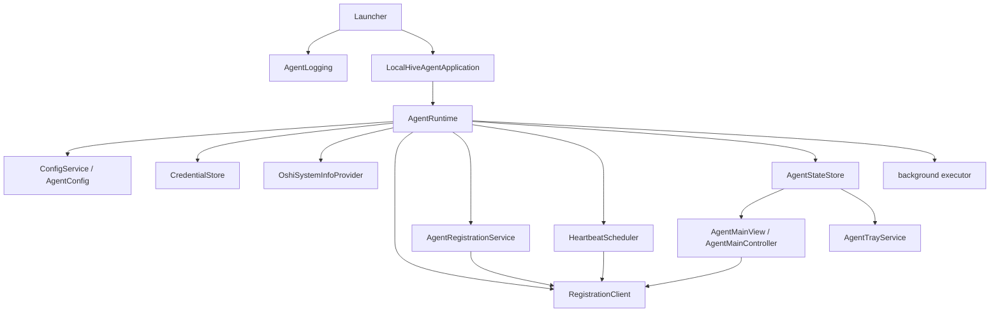
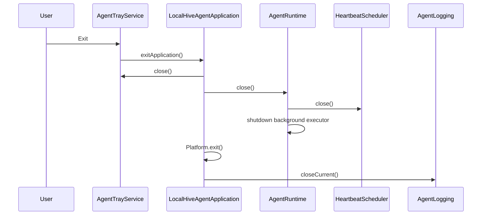

# LocalHive Agent Architecture

This document describes the architecture implemented in the LocalHive Agent repository. The broader LocalHive ADR describes a future Master-Worker system with Docker, game workloads, RCON, native packaging, and research-oriented protocol comparisons. Those areas are not implemented in the Agent yet unless explicitly listed here.

## Scope

The Agent is the worker-side desktop application. It is responsible for:

- Collecting local machine metadata through OSHI.
- Managing local Agent configuration.
- Storing the Worker API key outside `config.json`.
- Registering the machine with the LocalHive Master.
- Sending heartbeat payloads to the Master.
- Updating shared RAM allocation.
- Updating the hardware specification stored by the Master.
- Letting the user pause or resume worker availability.
- Providing the JavaFX dashboard and System Tray lifecycle.
- Polling and executing assigned work through registered Agent executors.

The Agent is not the Master. It does not own the database, admin UI, task queue, or worker approval workflow.

## High-Level Architecture



The runtime creates and owns application services. The dashboard and tray observe `AgentStateStore` instead of maintaining separate status models.

## Startup Lifecycle

Implemented startup flow:

1. `Launcher.main` creates the default `AgentLogPolicy`.
2. `AgentLogging.initialize` configures SLF4J Simple output and file mirroring.
3. JavaFX launches `LocalHiveAgentApplication`.
4. `LocalHiveAgentApplication.init` creates `AgentRuntime`.
5. `AgentRuntime.createDefault` creates configuration, system info, Master client, credential store, state store, registration service, heartbeat scheduler, and background executor.
6. `LocalHiveAgentApplication.start` loads or creates local config.
7. OSHI detects the current `MachineSpec`.
8. The JavaFX dashboard is created and styled.
9. `AgentTrayService` is initialized when System Tray is supported.
10. `AgentMainController.initialize` wires UI actions, subscribes to state changes, syncs config, and starts heartbeat automatically when Master URL, Worker ID, and API key are present.

## Runtime Composition

`AgentRuntime` is a small composition root, not a full dependency injection framework. It owns:

- `ConfigService`
- `SystemInfoProvider`
- `RegistrationClient`
- `AgentRegistrationService`
- `HeartbeatScheduler`
- `TaskPollingService`
- `ExecutorService` named `localhive-agent-background`
- `CredentialStore`
- `AgentStateStore`

`AgentRuntime.close()` is idempotent. It stops the heartbeat scheduler, shuts down the background executor, and closes the state store.

## Configuration

`AgentConfig` is the persisted configuration record:

- `masterBaseUrl`
- `workerId`
- `sharedRamMb`
- `pauseEnabled`

`ConfigService` stores it in:

```text
<user-home>/.localhive-agent/config.json
```

The service uses Jackson 3 and a read-write lock. Writes go through a sibling temporary file and an atomic replace when supported by the file system.

The API key is intentionally not part of `AgentConfig` and is not written to `config.json`.

## Master Communication

`RegistrationClient` uses Java `HttpClient` and Jackson JSON payloads. It currently supports:

- Worker registration.
- Heartbeat.
- Shared RAM allocation update.
- Hardware specification update.

The client normalizes a Master URL without a scheme by prepending `http://`. It does not enforce TLS, certificate pinning, mutual TLS, WebSocket, SOAP, or gRPC.

`MasterClientErrorMapper` maps selected HTTP and network errors to user-facing messages and sanitizes representative authentication header text from backend error messages.

## Heartbeat

`HeartbeatScheduler` uses a single-thread scheduled executor named `localhive-heartbeat`. The controller starts it with a 15 second interval.

Heartbeat behavior:

- Automatic startup is attempted when the Agent has Master URL, Worker ID, and API key.
- Manual start and stop are available from the Maintenance section.
- One-off heartbeat is available from the dashboard.
- Scheduled heartbeat sends `pauseEnabled` and `sharedRamMb`.
- Successful heartbeat records the timestamp and marks Master connection as connected.
- Failed heartbeat records an error, keeps the last successful timestamp, and marks attention required.

There is no documented retry or backoff policy beyond the scheduled interval.

## Central Agent State

The central state model consists of:

- `AgentStateStore`
- `AgentStateSnapshot`
- `AgentStateListener`
- `MasterConnectionState`
- `HeartbeatState`
- `WorkerMode`

`AgentStateStore` is UI-independent. It uses `AtomicReference<AgentStateSnapshot>` for snapshot updates and `CopyOnWriteArrayList` for listeners.

The store is the synchronization point for:

- Master connection state.
- Worker mode.
- Heartbeat state.
- Last successful heartbeat.
- Last message or error.
- Worker registration and API readiness flags.

Dashboard and System Tray both observe state changes. Listener failures are logged and do not block other listeners.

## Dashboard

The dashboard is built in Java code, not FXML.

Main classes:

- `AgentMainView`
- `AgentMainController`
- `DashboardSection`
- `ResourceOverviewPane`
- `SharedRamPane`
- `GamerModePane`
- `AgentStatePane`
- `MaintenanceActionsPane`
- `StatusBadge`

Sections:

- Header with Master status, worker mode, heartbeat status, and last successful heartbeat.
- Resources with RAM, shared RAM, CPU, hostname, IP address, OS, and GPU.
- Shared RAM allocation slider and input.
- Gamer Mode Pause/Resume.
- Agent State with Master URL, Worker ID, API key status, credential backend, config path, and last message.
- Maintenance actions for heartbeat diagnostics and hardware spec update.

Network operations are submitted through the background executor or scheduler. UI updates from background work are routed back to the JavaFX Application Thread.

## System Tray

System Tray integration lives in:

- `AgentTrayService`
- `AgentTrayActions`

`LocalHiveAgentApplication` creates the stage and wires lifecycle behavior, but the AWT menu is owned by `AgentTrayService`.

When tray initialization succeeds:

- JavaFX implicit exit is disabled.
- Closing the dashboard consumes the close request and hides the stage.
- Open Dashboard runs through `Platform.runLater`.
- AWT menu updates run through `EventQueue.invokeLater`.
- Pause/Resume delegates to `AgentMainController.toggleWorkerMode`.
- Exit removes the tray icon, closes runtime services, and exits JavaFX.

When tray support is unavailable or initialization fails, the app logs a warning and keeps the standard JavaFX close behavior.

## Credential Architecture

`CredentialStoreFactory` selects a backend based on operating system and backend availability:

- Windows: `WindowsDpapiCredentialStore`
- Linux with Secret Service: `LinuxSecretServiceCredentialStore`
- macOS with Keychain availability: `MacOsKeychainCredentialStore`
- Otherwise: `InsecureFileCredentialStore`

See [security.md](security.md) for details and limitations.

## Logging

Logging starts before the JavaFX application. `AgentLogging` configures SLF4J Simple and mirrors `System.err` to both console and bounded files when file logging is available.

The default log policy is:

- Directory: `<user-home>/.localhive-agent/logs`
- File prefix: `localhive-agent`
- Maximum file size: 10 MiB
- Maximum file count: 5

The logging implementation flushes and restores the previous `System.err` on close.

## Shutdown Lifecycle



Standard JavaFX shutdown also closes the tray service when present, closes runtime services, and closes logging. Runtime shutdown is guarded against repeated calls.

## Threading Model

| Thread / executor | Responsibility |
| --- | --- |
| JavaFX Application Thread | Stage, scene graph, dashboard controls, and view updates. |
| AWT Event Dispatch Thread | System Tray menu creation, menu label updates, tray notifications, and tray icon removal. |
| `localhive-heartbeat` | Scheduled heartbeat execution. |
| `localhive-agent-background` | Registration, one-off heartbeat, allocation update, hardware spec update, and Pause/Resume flow submitted by the controller. |

Rules:

- JavaFX UI changes must run on the JavaFX Application Thread.
- AWT tray changes must run on the AWT Event Dispatch Thread.
- Network operations must not run on the JavaFX Application Thread.
- `AgentStateStore` remains independent of both UI toolkits.

## Future Integration Boundary

The current Task Protocol support is limited to registered Agent executors such as NO_OP and constrained Docker workload execution. Docker execution is governed by local Agent policy; see [docker-policy.md](docker-policy.md).

Docker workloads may optionally download a Master-provided workspace package, unpack it under the Agent workspace directory, and mount it read-only at `/workspace`; see [workspace-artifacts.md](workspace-artifacts.md).

Docker workloads also receive an Agent-generated writable `/output` directory. After the container exits, the Agent scans regular output files and uploads them to the Master before reporting the terminal execution result; see [output-artifacts.md](output-artifacts.md).

Claimed executions may include a Master-provided `displayName`. The Agent stores the resolved display name in current execution state and local history for UI and log summaries, while executor lookup still uses `executorId` and `executorContractVersion`; see [execution-display-metadata.md](execution-display-metadata.md).

Broader workload types, Minecraft workload execution, RCON, native packaging, output artifact UI, GPU execution, and current workload display remain future work.
